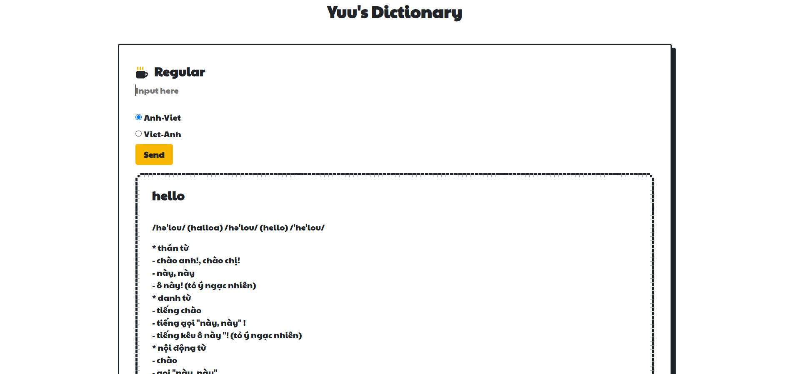

## Simple web-app dictionary
For my DSA-Project, I made a simple web-app dictionary, using Flask framework.

<p align="center"><b>Preview of the web-app</b></p>
<div style="text-align:center">
    
</div>

## Features

- **Word Lookup**: Users can enter a word in the search bar, and the application will return the definition of that words (Support both Vietnamese and English) if that word exists in database.
- **Autocomplete Suggestions**: As the user types in the search bar, the application provides autocomplete suggestions based on the existing words in the dictionary.
- **Efficient Lookup**: Utilizes a trie tree data structure for fast and efficient word lookup.

## Installation

1. Clone the repository:

```bash
git clone https://github.com/anzuukino/DSA-project.git
```

2. Navigate to the project directory:

```bash
cd DSA-project
```

3. Install dependencies:

```bash
pip install -r requirements.txt
```

## Usage

1. Start the Flask application:

```bash
python3 app.py
```

2. Open your web browser and go to `http://localhost:1337`.

3. You'll see a simple interface with a search bar. Enter a word to look up its existence in the dictionary.

4. As you type, autocomplete suggestions will appear based on existing words in the dictionary.


## Author :
**Ngo Phuc Duong - 23520350**

> **Special thanks to my teacher, Mr. Nguyen Thanh Son, for guiding me through this project.**
